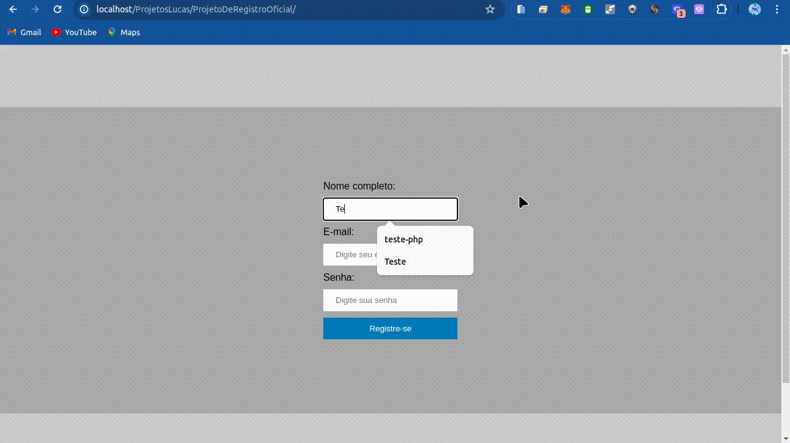
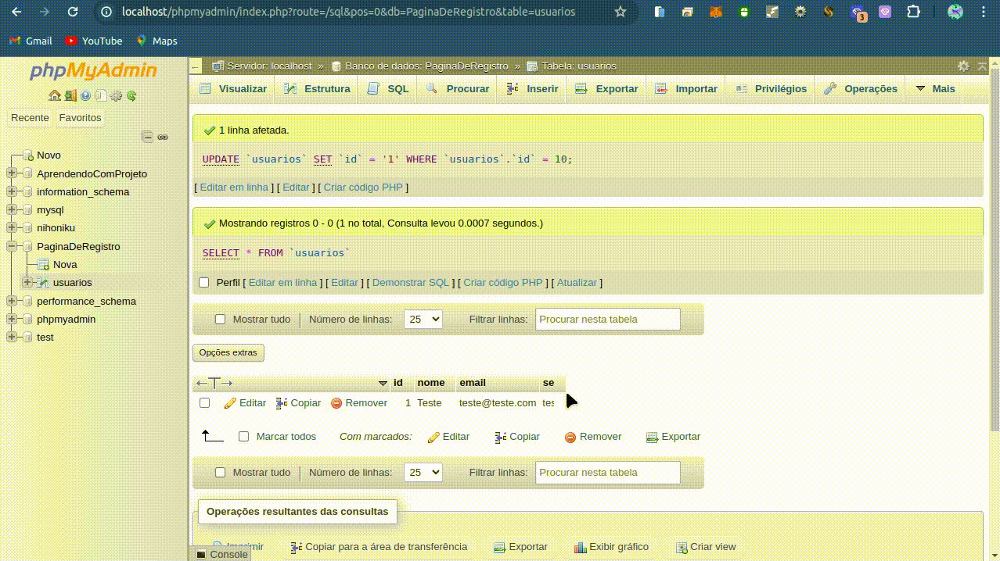
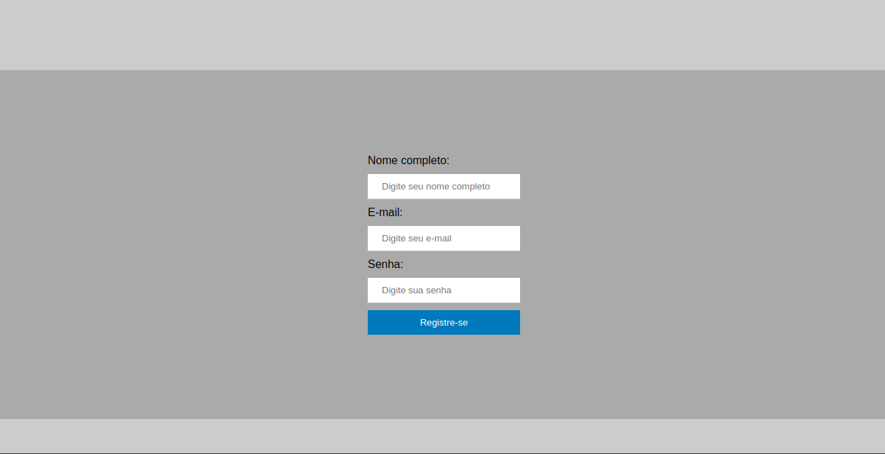

# ProjetoDeRegistro
Um projeto de página de registro feito com HTML, CSS e PHP + MySQLi

# Tutorial de como acessá-lo
Você tem que ter o XAMPP instalado em seu computador; mas você deve baixar todos os arquivos do repositório para acessar o projeto. E aí, depois de baixado, tem que extrair o arquivo ZIP, depois, você move para a pasta do XAMPP (C:\xampp\htdocs se você estiver no Windows; no Mac não sei e, no Linux, é /opt/lampp/htdocs). Por último, você deve abrir o XAMPP Control Panel (no Windows); e, no Linux, você coloca o seguinte comando: sudo /opt/lampp/lampp start (vai pedir sua senha de root e pronto, daí, você abre seu navegador, e você coloca: localhost/phpmyadmin você clica em bancos de dados, digite o nome do Banco de Dados como está ali no código clica em criar; cria a tabela usuarios daí você coloca no SQL o seguinte código:
CREATE TABLE usuarios (
  id INT(1) KEY AUTO_INCREMENT,
  nome VARCHAR(255),
  email VARCHAR(255),
  senha VARCHAR(255)
);

Mesmo que dê erro, vai dar certo. Você coloca o seguinte endereço localhost/nome_da_pasta (porém, você muda esse nome_da_pasta para nome da pasta que você baixou ou renomeou). Daí terminou.

# Imagens/vídeos do projeto
## Vídeos
Vídeo do projeto:

Vídeo do banco de dados:

## Imagens

